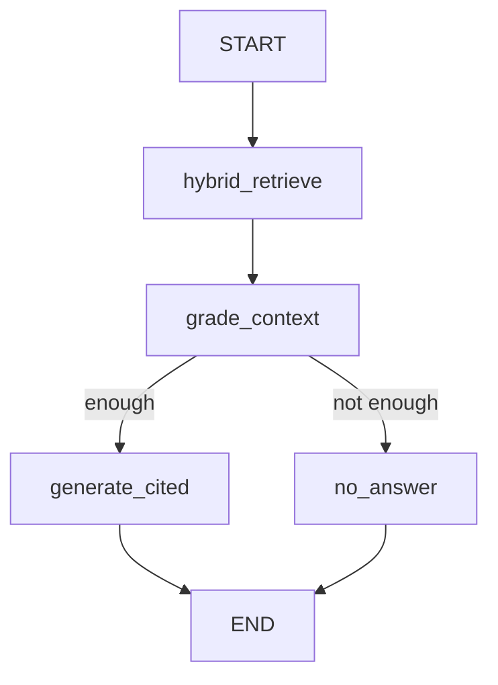

# StudyForge Support: architecture (v1)

Separate Python app for user tickets (how the system works, bugs, billing). This document is the spec only. No code in this repo. Implementation belongs in a **sibling git repo**.

StudyForge today has no ticketing. The web app only tells users to contact support on unexpected errors.

## Locked decisions

| Topic | v1 |
| --- | --- |
| Who | End users file. Staff close. Staff = Firebase custom claim `role: admin`. |
| Auth | Same Firebase project as StudyForge. Python verifies ID tokens. Store `userId` + email. |
| How it works | Hybrid RAG first. Ticket only if the user clicks **Still need help**. |
| Bug / billing | Always create a ticket. RAG may attach snippets for staff. No auto-answer gate. |
| Index | Seed curated markdown (including `docs/workspace-agent-knowledge-base.md` and a small FAQ) plus staff-edited articles. Do not embed raw tickets. |
| Store | Postgres: Help chunks (**pgvector**, **tsvector**) and a processing copy of tickets. Firestore SoT for commands/tickets that Eventarc watches. Lean Firestore (`supportTickets`, `supportAskResults`) is the chat read model. |
| Repo | Sibling repo. No Yarn/NX. No `@study-forge` Python imports. Join key is Firebase UID. |
| UI | StudyForge web (`/support`) is the user surface. sfs FastAPI is staff plus Help articles. |
| Bus | Label-hold CDC: Firestore write, Eventarc, sfs `/__eventarc/publish` (only Pub/Sub publisher), OIDC push consumer. Datastream is out. |
| Models | OpenRouter embeddings (`intfloat/multilingual-e5-large` or the same route StudyForge uses). Together/MiniMax for generation. OpenAI-compatible LangChain clients. |
| Category | User picks: **how_it_works**, **bug**, **billing**. |
| Lifecycle | **open** / **closed**. In-app thread. No email. |
| Grounding | Answer only from retrieved chunks. Cite article titles. Weak retrieval: say so, offer **Still need help**. |
| Graph | Small LangGraph: retrieve, grade context, generate or no-answer. Not a ReAct agent. |
| Files | Text only. Optional URL. No uploads. |
| Run | Docker Compose (FastAPI + `pgvector/pgvector`). Prod later: same images, not Firebase Hosting. |
| Traces | LangSmith project `study-forge-support`. Not `study-forge`. |

## Goals and non-goals

**Goals**

- Users ask how StudyForge works and get a cited answer from help articles.
- Users file bugs and billing questions that always reach a human queue.
- Staff reply on the thread and close tickets.
- Staff add/edit help articles and re-index without a StudyForge deploy.

**Non-goals (v1)**

- Email, SLA, assignments, CSAT, waiting-on-user status.
- Indexing past tickets or PII for search.
- File/screenshot storage.
- Staff queue inside NX admin.
- Datastream / Cloud SQL CDC.
- Auto-close from the model.
- Kubernetes.

## System shape

```mermaid
flowchart LR
  user[StudyForge user]
  staff[Staff admin claim]
  ui[FastAPI UI]
  api[FastAPI API]
  graph[LangGraph how_it_works]
  pg[(Postgres pgvector plus FTS)]
  fb[Firebase Auth]
  llm[OpenRouter embeddings Together chat]
  ls[LangSmith study-forge-support]
  user --> ui
  staff --> ui
  ui --> api
  api --> fb
  api --> pg
  api --> graph
  graph --> pg
  graph --> llm
  graph --> ls
```

The support app does **not** call StudyForge Firebase Functions for tickets. Users do not `fetch` sfs. sfs writes Firestore **SoT** rows so Eventarc can publish. A consumer writes the **lean** read model. Local emulator may materialize lean docs without Eventarc.

## User flows

### How it works

1. Sign in (Firebase). Pick category **How it works**. Type a question.
2. API runs LangGraph. Hybrid search over published article chunks.
3. If context is enough: show answer + citations. Buttons: **That helped** (no ticket) and **Still need help**.
4. **Still need help** creates an **open** ticket with the question, the draft answer, retrieved chunk ids, and a first user message.
5. If context is not enough: show a short “I do not have that in the help articles” plus **Still need help**.

### Bug / billing

1. Sign in. Pick **Bug** or **Billing**. Type the report. Optional URL.
2. Create **open** ticket immediately.
3. Optionally run hybrid search in the background and store `staff_context` (snippets + article titles) for the staff view. Do not show a generated “resolution” as if the ticket is done.

### Staff

1. Sign in. Reject if `role` is not `admin`.
2. List open tickets. Open a thread. Post a reply. Close.
3. CRUD help articles. Saving a published article re-chunks, re-embeds, and updates `tsvector`.

## Data model (Postgres)

Use SQLAlchemy or similar. UUIDs for ids. Timestamps in UTC.

**articles**

- `id`, `title`, `body_markdown`, `status` (`draft` | `published`), `source` (`seed` | `staff`), `seed_path` nullable, `updated_by`, `updated_at`

**chunks**

- `id`, `article_id`, `chunk_index`, `text`, `embedding vector`, `tsv tsvector`, `content_hash`
- Index: HNSW or IVFFlat on `embedding`; GIN on `tsv`

**tickets**

- `id`, `user_id` (Firebase UID), `user_email`, `category` (`how_it_works` | `bug` | `billing`), `status` (`open` | `closed`), `title`, `url` nullable, `created_at`, `closed_at` nullable, `closed_by` nullable

**messages**

- `id`, `ticket_id`, `author_type` (`user` | `staff` | `system`), `author_id` nullable, `body`, `created_at`
- System rows: RAG draft, “no context”, citations JSON

**rag_runs** (optional but useful)

- `id`, `user_id`, `category`, `query`, `ticket_id` nullable, `langsmith_run_id` nullable, `created_at`

Do not put billing amounts or full ticket bodies into `chunks`.

## Hybrid search

LangChain’s documented persistent store for this stack is `langchain-postgres.PGVector` ([RAG with Deep Agents](https://docs.langchain.com/oss/python/deepagents/rag), [PGVector integration](https://docs.langchain.com/oss/python/integrations/vectorstores/pgvector)). Core LangChain does not give a complete “hybrid search in one call” for Postgres. v1 should:

1. **Vector**: cosine similarity on `chunks.embedding` (same embedding model as ingest). Top `k` (start at 8).
2. **Keyword**: Postgres full-text (`plainto_tsquery` / `websearch_to_tsquery` on `tsv`). Top `k`.
3. **Fuse**: Reciprocal Rank Fusion (RRF) on the two ranked lists. Return top 6 chunks to the graph (same order of magnitude as StudyForge platform-knowledge `MAX_MATCH_COUNT`).

Ingest: split markdown (size ~800, overlap ~120 is a reasonable start; match StudyForge knowledge chunking unless eval says otherwise). Embed with OpenRouter e5. Build `tsv` from the same `text` (`to_tsvector('english', text)` plus title).

Re-index an article in one transaction: delete old chunks, insert new ones.

## LangGraph (how_it_works only)

State: `query`, `chunks`, `enough_context` (bool), `answer`, `citations`, `no_answer_reason`.



- **hybrid_retrieve**: RRF list, attach `article_id` / title.
- **grade_context**: small structured call (thinking off, JSON): is there enough to answer without guessing? If zero chunks, skip the LLM and set not enough.
- **generate_cited**: answer only from chunk text. List source titles. No credit numbers unless they appear in chunks.
- **no_answer**: fixed copy + flag for the UI to show **Still need help**.

Bugs/billing never enter this graph except an optional retrieve-only helper for `staff_context`.

Trace with `LANGSMITH_TRACING=true`, `LANGSMITH_PROJECT=study-forge-support`.

## Auth

- User and staff UIs use Firebase JS (same `NX_PUBLIC_FIREBASE_*` project).
- API: `Authorization: Bearer <idToken>`. Verify with Firebase Admin (`google-auth` / Firebase Admin Python) against the same project id.
- Staff routes: decoded token `role == admin`.
- Users may only read/write their own tickets. Staff may read all.

No anonymous tickets in v1.

## API sketch

All JSON, all authenticated unless noted.

- `GET /api/me`
- `POST /api/ask` body `{ category, query }` — how_it_works runs the graph; bug/billing returns `{ skip_rag: true }`
- `POST /api/tickets` body `{ category, query, url?, rag_run_id? }`
- `GET /api/tickets` — user: own. Staff: all, filter `status`
- `GET /api/tickets/{id}`
- `POST /api/tickets/{id}/messages` `{ body }`
- `POST /api/tickets/{id}/close` — staff
- `GET/POST/PATCH /api/articles` — staff
- `POST /api/articles/{id}/reindex` — staff

## UI sketch

**User:** sign in, category, textarea, submit. How-it-works result pane (answer or no-answer) + **Still need help**. List “My tickets”. Ticket thread.

**Staff:** queue (open first), ticket thread + `staff_context`, close. Articles list, editor, publish/reindex.

Keep the UI boring (server-rendered templates or a thin SPA). Do not use MUI. This app is not bound to StudyForge shadcn, but stay simple.

## Repo layout (sibling)

Suggested name: `study-forge-support`.

```text
study-forge-support/
  docker-compose.yml
  Dockerfile
  pyproject.toml
  .env.example
  README.md
  docs/architecture.md   # copy of this spec
  seed/                  # curated markdown copies
  app/
    main.py
    auth.py
    models.py
    api/
    rag/
      graph.py
      hybrid.py
      embeddings.py
    ui/
```

`.env.example`: Firebase project, `FIREBASE_WEB_API_KEY` (client), service account or ADC for token verify, `OPENROUTER_API_KEY`, `TOGETHER_AI_API_KEY`, `LANGSMITH_*`, `DATABASE_URL`.

Seed copies of StudyForge markdown by path documented in README (manual copy or a script run from a local checkout of StudyForge). Do not add a Python dependency on the NX workspace.

## StudyForge follow-ups (not v1 of this spec)

- A **Support** link in `web` once the support app has a URL.
- Optional: pass the ID token in the query/hash for fewer logins (careful with token in URLs).
- Later: similar-ticket index with redaction; email; screenshot upload.

## References

- [LangChain RAG (Deep Agents)](https://docs.langchain.com/oss/python/deepagents/rag) — `PGVector` from `langchain-postgres`
- [PGVector integration](https://docs.langchain.com/oss/python/integrations/vectorstores/pgvector)
- [Evaluate a RAG application](https://docs.langchain.com/langsmith/evaluate-rag-tutorial) — later evals for this app, not v1
- StudyForge platform-knowledge retrieval: [workspace-agent-platform-knowledge-retrieval.md](../langsmith/workspace-agent-platform-knowledge-retrieval.md)
